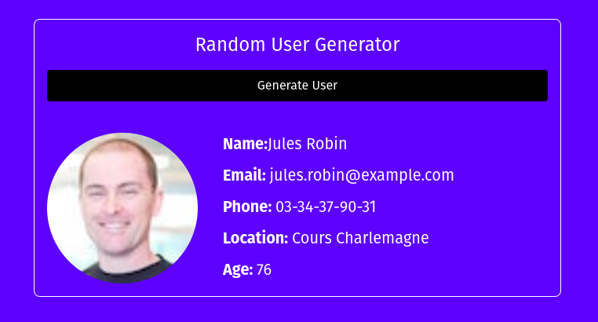

### Random user generator 

This app was built while learning about fetching data from public APIs using the fetch API and promises and manipulating the DOM using the data fetched.

Public API used - https://randomuser.me/

index.html and spinner.css were used as templates

Preview -

 

